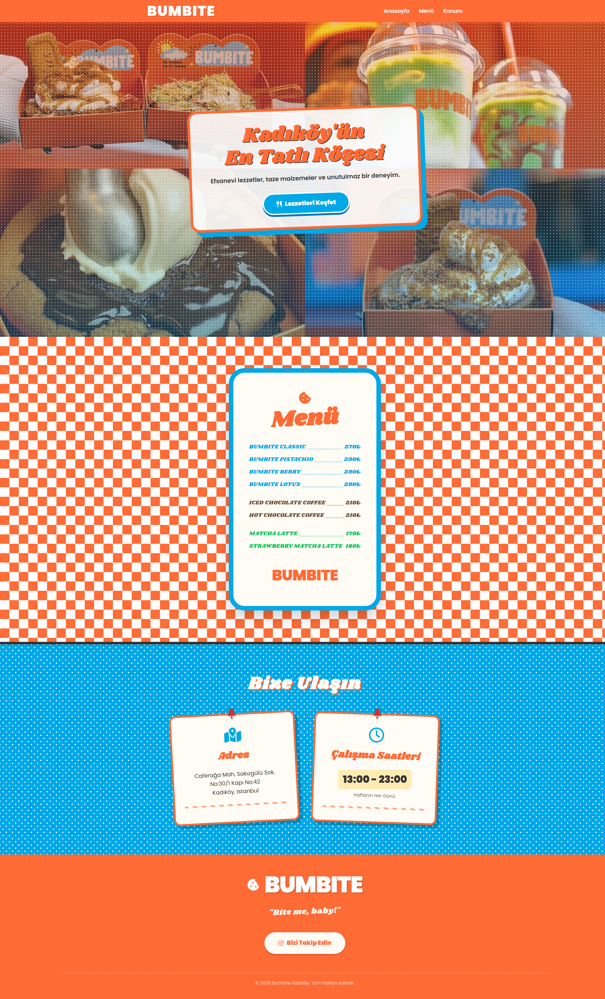

# ☁️ Bumbite 

<h3>
Bumbite, kendimi geliştirmek için bazı markaların (tarzını beğendiğim) sitelerini yeniden tasarladığım bir projedir. Yayınlanacak ya da para alarak yaptığım bir site değildir. Tamamen eğlence ve pratik amaçlıdır.
</h3>

## 🔗 Canlı Demo
Projenin yayındaki halini buradan inceleyebilirsiniz: [Bumbite - Canlı Siteye Git](https://kattiieo.github.io/Bumbite/)

## 💻 Kullanılan Teknolojiler
* HTML5
* CSS3

## 🎨 Proje Hakkında
Bu projeyi geliştirirken amacım; bir tatlı markası için samimi, eğlenceli ve dikkat çekici bir arayüz oluşturmaktı.
* **Renk Paleti:** Markanın orijinal kimliğine sadık kalarak mavi, turuncu ve beyaz renklerini kullanmaya özen gösterdim.

---
### İletişim
Benimle ve diğer projelerimle ilgili detaylara buradan ulaşabilirsiniz:
[Bento Profilim][def]

[def]: https://bento.me/aur3in
